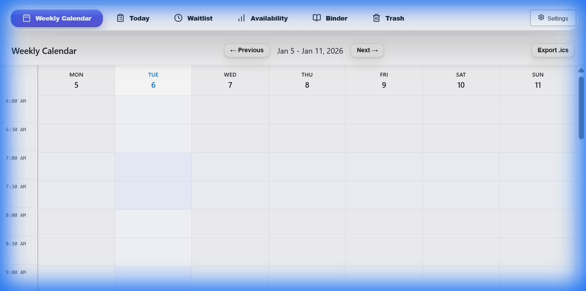
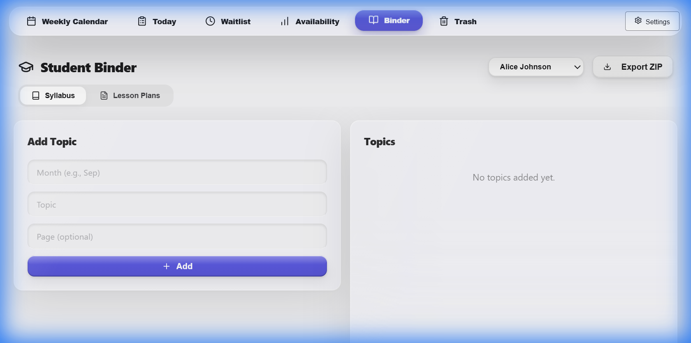
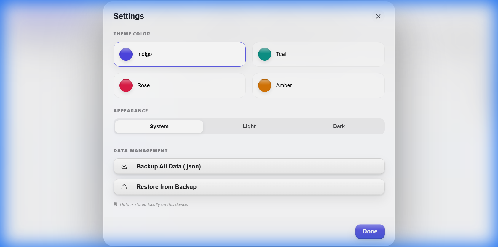
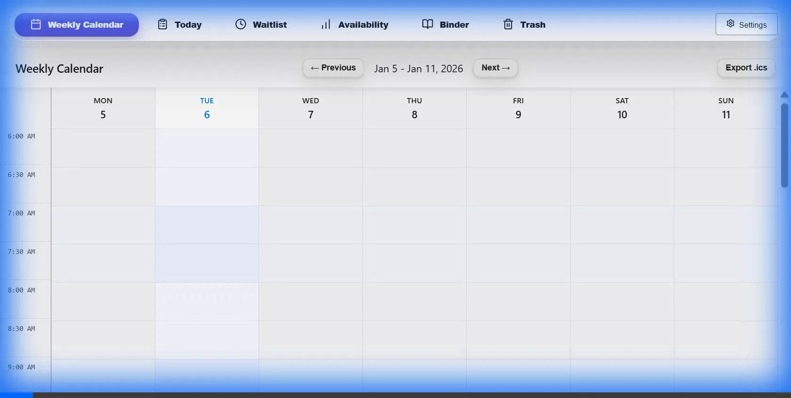

# 🎓 Tutor Virtual Classroom

A premium, offline-first tutoring management workspace designed for teachers who need a reliable, private, and high-performance environment on **iPhone, iPad, and Desktop**.



## ✨ Core Features

### 📅 Intelligent Scheduling
- **Weekly Calendar**: 30-minute time slots (6 AM → 10 PM) with a Monday start.
- **Smart Modal**: Conflict resolution and student-duration matching.
- **Data Portability**: Export `.ics` files to sync with Google Calendar or Outlook.

### 🔖 Student Detail Binder
- **Syllabus Tracking**: Keep months and topics organized.
- **Lesson Planning**: Document resources, notes, and specific teaching plans.
- **Binder Export**: Download a complete student archive as a ZIP file.

### 🕒 Smart Waitlist
- **Priority Management**: Automatically match waitlisted students to open slots.
- **Weekly Windows**: Define specific availability for each student.

### 💾 Advanced Data Management
- **Full System Backup**: Export your entire database to a JSON file.
- **One-Click Restore**: Migrate data between devices seamlessly.
- **PWA Ready**: Install as a standalone app on iOS/Android (Add to Home Screen).

---

## 🏗️ Architecture & Tech Stack

The project follows a **Local-First** philosophy, ensuring speed and privacy.

- **Frontend**: React 18 + TypeScript + Vite
- **Styling**: `styled-components` (Refractive Glass Design System)
- **State**: Modular Zustand Stores (Slices for Events, Students, Requests)
- **Database**: IndexedDB via **Dexie.js**
- **Testing**: Vitest + axe-core (Accessibility)

### Directory Structure
```text
src/
├── features/     # Feature-based domain logic (binder, calendar, etc.)
├── ui/           # Standardized UI primitives (Button, Modal, etc.)
├── store/        # Modular Zustand store slices
├── db/           # Database schema and Repository Layer
├── repositories/ # Unified data access layer
└── utils/        # Shared utilities (Backup, ICS export)
```

---

## 🚀 Getting Started

### Prerequisites
- Node.js 18+
- npm 9+

### Installation
```bash
# Clone and install
npm install

# Start development server
npm run dev
```

### 📱 Installing on Mobile
1. Open the app link in **Safari** (iOS) or **Chrome** (Android).
2. Tap the **Share** button.
3. Select **"Add to Home Screen"**.

---

## 📸 Screenshots

| Dashboard | Student Binder |
| :---: | :---: |
|  |  |

| Data Management | Onboarding Flow |
| :---: | :---: |
|  |  |

---

## ✅ Quality & Verification
We maintain high standards for code quality and accessibility.
- **Automated Tests**: `npm test`
- **Linting**: `npm run lint`
- **A11y**: 100% pass rate on automated accessibility scans.

---

## 📄 License
This project is private and intended for personal tutoring use.
